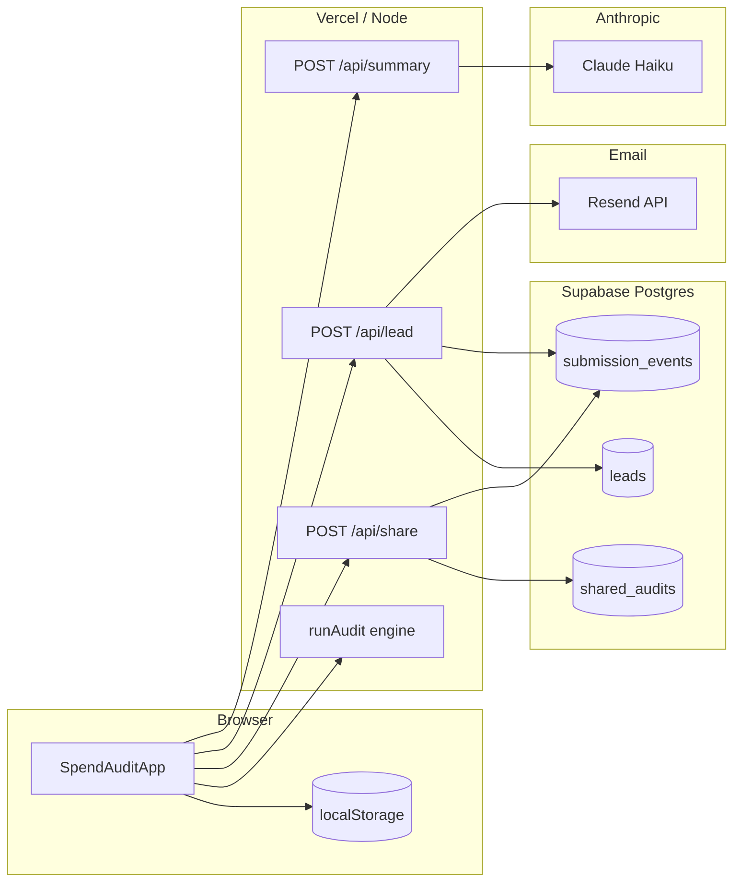

# Architecture

## System diagram

## Data flow: input → audit → share

1. User edits **multi-tool spend lines** + team context; React state persists to `localStorage`.  
2. On **Run audit**, the client calls `runAudit()` (pure TypeScript) → structured `AuditResult`.  
3. Client builds a **PII-stripped** `PublicAuditPayload` (`toPublicPayload`) for sharing + LLM.  
4. **Share:** POST `/api/share` inserts JSON into `shared_audits` with random `slug`; response returns `/r/{slug}`.  
5. **Public page:** Server component loads row by `slug`, validates JSON with Zod, renders read-only snapshot; `generateMetadata` sets OG/Twitter tags.  
6. **Lead capture:** After value is shown, POST `/api/lead` stores email (+ optional fields) and sends Resend mail if configured.  
7. **AI summary:** POST `/api/summary` asks Anthropic for a short paragraph; on failure, deterministic fallback text.

## Stack choice

- **Next.js 16 (App Router) + TypeScript** — SSR for OG metadata on share routes, API routes for secrets, React for the interactive form, one deploy target on Vercel.  
- **Tailwind CSS v4** — fast UI iteration without a site builder; full control over landing + results layout.  
- **Supabase Postgres** — quickest managed DB with JSONB for audit payloads; service role used only in server handlers.  
- **Vitest** — lightweight unit tests for the audit engine without spinning up Playwright.

## At 10k audits/day

- Move rate limiting to **Redis** (Upstash) with sliding windows; keep honeypot.  
- **Partition** `submission_events` or TTL old rows nightly.  
- **Edge-cache** immutable `/r/{slug}` responses via CDN + `Cache-Control`.  
- **Queue** Resend + Anthropic calls asynchronously (background worker) to cap tail latency.  
- **Split** write path: Kafka → warehouse for analytics instead of querying Postgres for metrics.
